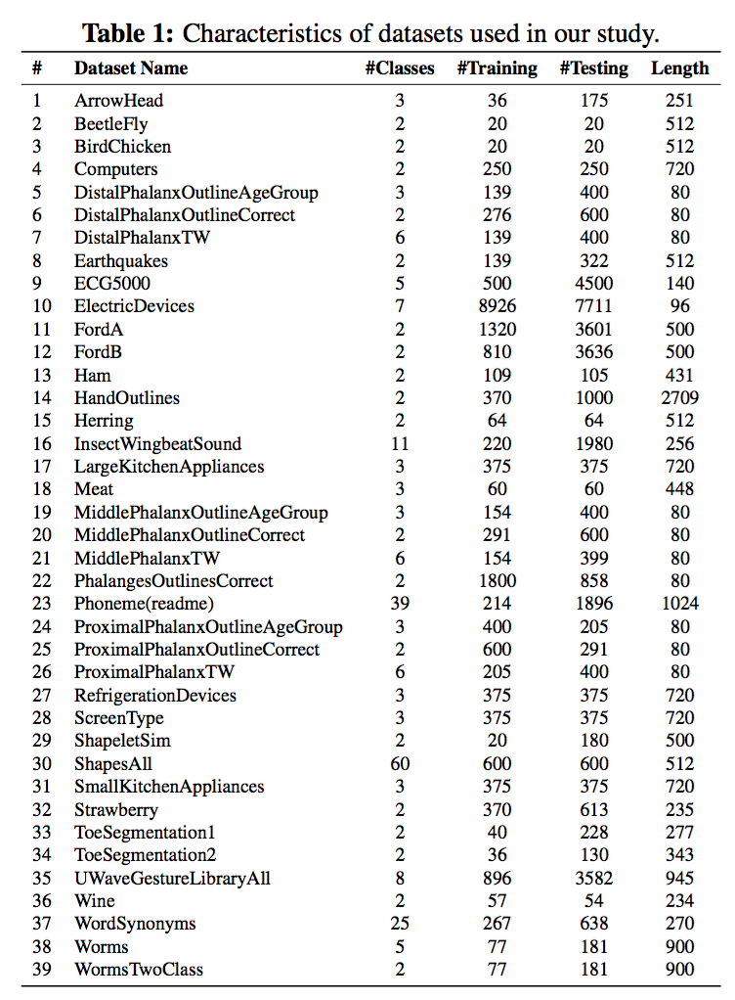
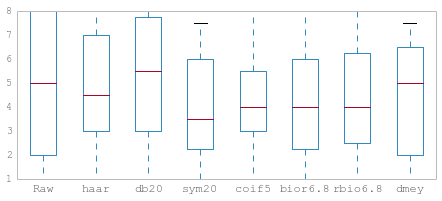
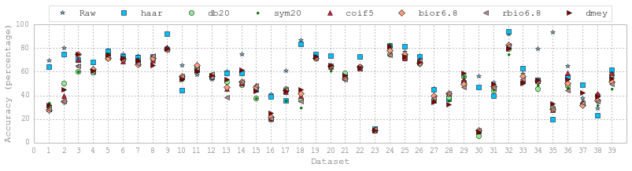
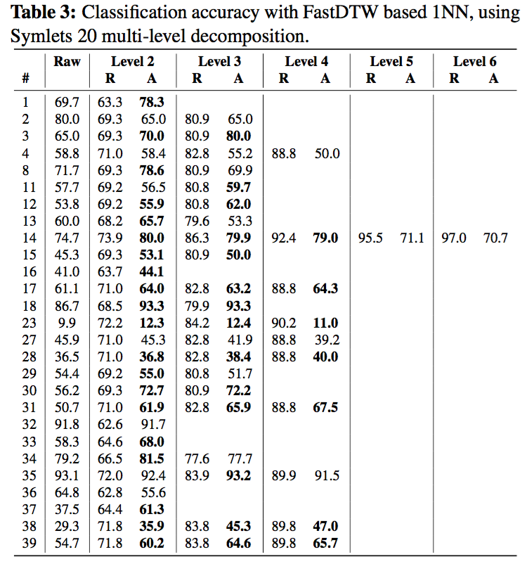

# wavelets-tsc

This repository is to support our paper titled "Time Series Classification with Discrete Wavelet Transformed Data: Insights from an Empirical Study" submitted to SEKE.

## Experiment results

